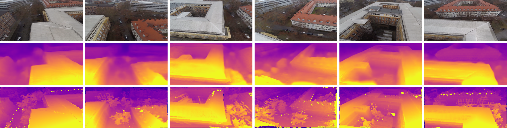

# Self-Supervised Learning for Monocular Depth Estimation from Aerial Imagery
Hermann, M., Ruf, B., Weinmann, M., and Hinz, S.: SELF-SUPERVISED LEARNING FOR MONOCULAR DEPTH ESTIMATION FROM AERIAL IMAGERY, ISPRS Ann. Photogramm. Remote Sens. Spatial Inf. Sci., V-2-2020, 357–364, https://doi.org/10.5194/isprs-annals-V-2-2020-357-2020, 2020. 

> Supervised learning based methods for monocular depth estimation usually require large amounts of extensively annotated training data. 
In the case of aerial imagery, this ground truth is particularly difficult to acquire. 
Therefore, in this paper we present a method for self-supervised learning for monocular depth estimation from aerial imagery that does not require annotated training data. 
For this, we only use an image sequence from a single moving camera and learn to simultaneously estimate depth and pose information. 
By sharing the weights between pose and depth estimation, we achieve a relatively small model, which favors real-time application. 
We evaluate our approach on three diverse datasets and compare the results to conventional methods that estimate depth maps based on multi-view geometry. 
We achieve an accuracy delta 1.25 of up to 93.5%. 
To test the performance of various configurations, we also conducted an ablative study. 
In particular, we analyze different encoder architectures, image resolutions and the effects of a low batch size. 
In addition, we have paid special attention to the generalization of a trained model to unknown data and the self-improving capabilities of our approach. 
In our analysis this leads to a considerable drop in quality. 
However, since our model is not dependent on ground truth depth maps, training and application phase are not as clearly separated as in classical supervised learning.  
By training a basic model and then fine-tuning it to unknown data while continuously observing the progress, we are able to demonstrate the self-improving capability of this technique. 
This continued learning in practical use improves the results within a short time, which reduces the issues of generalization. 
We conclude, that even though the results of monocular depth estimation are inferior to those achieved by conventional methods, they are well suited to provide a good initialization for methods that rely on image matching or to provide estimates in regions where image matching fails, eg. occluded or texture-less regions. 

Results on our synthtic dataset (first row input image, second row prediction, third row ground truth):


## Prerequisites
This codebase was developed and tested with Tensorflow 1.14, CUDA 10.0 and Ubuntu 18.04.

Install packages :
```bash
pip install -r requirements.txt
```


## Preparing training data
We used data from UAV-videos from rural and urban scences. These datsests will be published later.
To gather more training data we used https://github.com/umautobots/GTAVisionExport to export synthetic data from GTAV.


To prepare data we used code from https://github.com/tinghuiz/SfMLearner/

```bash
python data/prepare_train_data.py --dataset_dir=<path-to-dataset-dir> --dump_root=<path-to-dump-dir> --seq_length=3 --img_width=384 --img_height=224 --num_threads=16 --frame_offset <offset-between-frames>
```

## Training

```bash
python train.py --dataset_dir=<path-to-dump-dir> --checkpoint_dir=<-where-to-store-checkpoints> --img_width=384 --img_height=224 --batch_size=20
```
You can then start a tensorboard session by
```bash
tensorboard --logdir=<-where-to-store-checkpoints>
```
## Additional results
Ground truth was generated with COLMAP https://github.com/colmap/colmap
Results on rural dataset:


Results on urban dataset:

